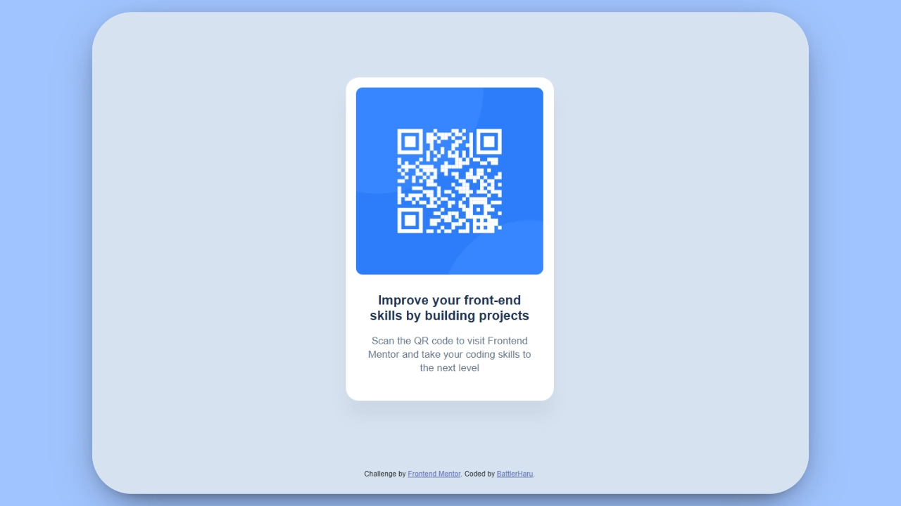

# Frontend Mentor - QR code component solution

This is a solution to the [QR code component challenge on Frontend Mentor](https://www.frontendmentor.io/challenges/qr-code-component-iux_sIO_H). Frontend Mentor challenges help you improve your coding skills by building realistic projects.

## 📃 Table of contents

1. [Overview.](#overview)
2. [Preview.](#-preview)
3. [Getting Started.](#-getting-started)
4. [Features.](#-features)
   - [Built with.](#-built-with)
5. [What I learned.](#-what-i-learned)
6. [Continued development.](#-continued-development)
7. [Acknowledgments.](#-acknowledgments)

## Overview

Recreated a QR code component from a Figma design using only HTML and CSS, focusing on proper structure, clean styling, and responsive centering.

## 📸 Preview



## 🚀 Getting Started

Just clone and open `index.html` in your browser.

## ✨ Features

- Simple, clean HTML & CSS structure
- Centralized card layout
- Custom properties for colors and spacing

### ✅ Built with

- Semantic HTML
- CSS with variables
- BEM methodology
- Flexbox for layout

### 💡 What I learned

The main challenge was the title font size: the design suggested 22px, but this caused the text to wrap into 3 lines instead of 2. I reduced it to 20px to keep the layout consistent.

```css
.card__title {
  /* Adjusted to maintain design integrity */
  font-size: 20px;
}
```

### 🔮 Continued development

I want to focus on typography handling and responsive adjustments for better scalability in future projects.

### 🙌 Acknowledgments

Thanks to Frontend Mentor for providing the challenge and resources!
